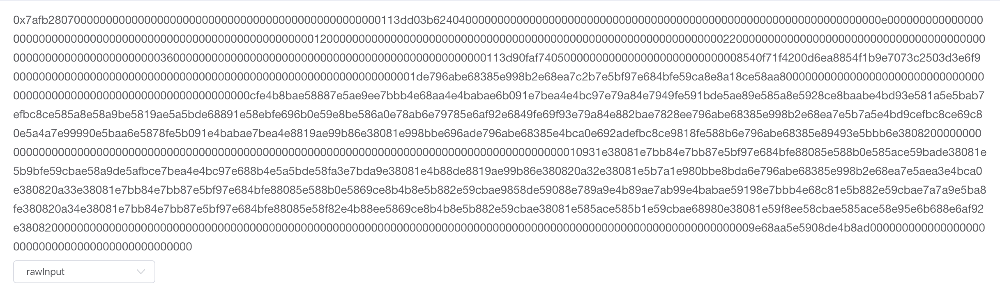

# Solidity-utils

其他语言： [English](./README_en.md)

## 说明

帮助开发者处理以太坊数据的工具类，目前实现分析在以太坊区块链中关于智能合约交易的Input数据。

在以太坊区块链数据中，可以通过查询transaction来查看该交易的附加数据，如果某区块链项目将公示数据上链，则用户可以通过Hash查看某交易的公示数据，以达到区块链本身数据公开透明的效果。但是获得tx.Data()的原生数据为字节数组，且按照一定规律进行存储，直接输出如图1所示，用户可读性低，需要用户进行相应的解析才能看到真实数据。

而本工具则提供TransformTxData()方法，传入智能合约的abi和交易的Data，则输出经过处理后的可读数据，如图2所示。



图1  初始数据


图2  处理后的数据


## 参考文章

1. 关于以太坊的数据类型

[（1）Solidity编程 五 之 数据类型](https://www.cnblogs.com/StephenWu/p/7096550.html)

[（2）深入理解Solidity-类型](https://solidity-cn.readthedocs.io/zh/develop/types.html#arrays)

2. 关于智能合约二进制接口

[（3）智能合约应用程序二进制接口规范](https://www.cnblogs.com/chenshouchang/p/9979845.html)

3. 其他工具

   [(4)进制转换工具](https://tool.lu/hexconvert/)


## 智能合约二进制接口

此处参考：

[智能合约应用程序二进制接口规范](https://www.cnblogs.com/chenshouchang/p/9979845.html)，建议先阅读此文章，该文章详细解释了智能合约中的二进制存储规范。

[深入理解Solidity-类型](https://solidity-cn.readthedocs.io/zh/develop/types.html#arrays)

### 数据类型

智能合约有以下基本类型，包括静态类型和动态类型，而静态类型则分为基本类型和固定数组长度。

静态类型与动态类型的区别在于，虚拟机存储时，会先存储静态类型数据，当遇到动态类型数据时，会记录下偏移量，在偏移位置存储数据部分，而此时的数据部分包括数据长度和数据内容本身。

```go
uint<M>: M位无符号整型, 0 < M <= 256, M % 8 == 0. e.g. uint8, uint16, uint24, uint36, uint256，静态类型

int<M>:  M位有符号整型, 0 < M <= 256, M % 8 == 0. e.g. int8, int16, int24, int36, int256，静态类型

address: 与 uint160 类似, 160位数据类型，静态类型

uint, int:  分别等同于 uint256, int256，静态类型

bool: 与 uint8 类似，但值仅限于0和1，静态类型

fixed<M>x<N>:  有符号的定长浮点型, M表示该类型占用的位数， 8 <= M <= 256, M % 8 ==0 N表示可用的小数位数 0 < N <= 80. e.g. fixed128x18，静态类型

ufixed<M>x<N>: 无符号的定长浮点型，M表示该类型占用的位数， 8 <= M <= 256, M % 8 ==0 N表示可用的小数位数 0 < N <= 80. e.g. ufixed128x18，静态类型

fixed, ufixed: 分别等同于 fixed128x18, ufixed128x18，静态类型

bytes<M>: 定长字节数组, 0 < M <= 32，静态类型

function: 包含20字节的function地址和4字节的函数标识，等同于bytes24，静态类型


bytes: 类似于byte[],但元素是连续存在一起的（不会补0），而byte[]是按每32字节一单元的方式存放，动态类型

string: 以UTF-8编码方式编码的字符串，动态类型

<type>[]: 存储<type>类型元素的数组，动态类型

(T1,T2,...,Tn): 包含了 types T1, …, Tn 的元组, n >= 0，动态类型

```

在这里，仅支持以下几种常见数据类型的转换。

```
boolint
address
string
bytes1, byte2, ... , byte31, byte32 
int, int8, int16, ... ,int248, int256
uint, uint8, uint16, ... ,uint248, uint256
int<M>[], uint<M>[], bytes<M>[] // 静态数据类型定长数组
```

### 数据分析

根据智能合约二进制存储规范[1](https://www.cnblogs.com/chenshouchang/p/9979845.html)，可将以下从transaction中得到的Input数据进行分割并详细解析，以方法 createActivity()为例：

```solidity
function createActivity(genesisId: uint256, name: string, brief: string, detail: string, status: string, associationId: uint256, creator: address)
```

1. 原数据：

```go
0x7afb2807000000000000000000000000000000000000000000000000113dd03b6240400000000000000000000000000000000000000000000000000000000000000000e0000000000000000000000000000000000000000000000000000000000000012000000000000000000000000000000000000000000000000000000000000002200000000000000000000000000000000000000000000000000000000000000360000000000000000000000000000000000000000000000000113d90faf74050000000000000000000000000008540f71f4200d6ea8854f1b9e7073c2503d3e6f9000000000000000000000000000000000000000000000000000000000000001de796abe68385e998b2e68ea7c2b7e5bf97e684bfe59ca8e8a18ce58aa800000000000000000000000000000000000000000000000000000000000000000000cfe4b8bae58887e5ae9ee7bbb4e68aa4e4babae6b091e7bea4e4bc97e79a84e7949fe591bde5ae89e585a8e5928ce8baabe4bd93e581a5e5bab7efbc8ce585a8e58a9be5819ae5a5bde68891e58ebfe696b0e59e8be586a0e78ab6e79785e6af92e6849fe69f93e79a84e882bae7828ee796abe68385e998b2e68ea7e5b7a5e4bd9cefbc8ce69c80e5a4a7e99990e5baa6e5878fe5b091e4babae7bea4e8819ae99b86e38081e998bbe696ade796abe68385e4bca0e692adefbc8ce9818fe588b6e796abe68385e89493e5bbb6e380820000000000000000000000000000000000000000000000000000000000000000000000000000000000000000000000010931e38081e7bb84e7bb87e5bf97e684bfe88085e588b0e585ace59bade38081e5b9bfe59cbae58a9de5afbce7bea4e4bc97e688b4e5a5bde58fa3e7bda9e38081e4b88de8819ae99b86e380820a32e38081e5b7a1e980bbe8bda6e796abe68385e998b2e68ea7e5aea3e4bca0e380820a33e38081e7bb84e7bb87e5bf97e684bfe88085e588b0e5869ce8b4b8e5b882e59cbae9858de59088e789a9e4b89ae7ab99e4babae59198e7bbb4e68c81e5b882e59cbae7a7a9e5ba8fe380820a34e38081e7bb84e7bb87e5bf97e684bfe88085e58f82e4b88ee5869ce8b4b8e5b882e59cbae38081e585ace585b1e59cbae68980e38081e59f8ee58cbae585ace58e95e6b688e6af92e3808200000000000000000000000000000000000000000000000000000000000000000000000000000000000000000000000000000000000009e68aa5e5908de4b8ad0000000000000000000000000000000000000000000000
```

2. 分割后的数据

```go
// 以32个字节为单位进行分割

0x7afb2807 //MethodID, Keccak散列的前4个字节
000000000000000000000000000000000000000000000000113dd03b62404000	//	uint256(静态) genesisId
00000000000000000000000000000000000000000000000000000000000000e0	//	string偏移量224个字节(动态) name
0000000000000000000000000000000000000000000000000000000000000120	// 	string偏移量288个字节(动态) brief
0000000000000000000000000000000000000000000000000000000000000220	//	string偏移量544个字节(动态) detail
0000000000000000000000000000000000000000000000000000000000000360	//	string 偏移量864个字节(动态) status
000000000000000000000000000000000000000000000000113d90faf7405000	//	uint256(静态) associationId
0000000000000000000000008540f71f4200d6ea8854f1b9e7073c2503d3e6f9	//	address(静态) creator

000000000000000000000000000000000000000000000000000000000000001d	//	长度29个字节 name
e796abe68385e998b2e68ea7c2b7e5bf97e684bfe59ca8e8a18ce58aa8000000	//	数据内容

00000000000000000000000000000000000000000000000000000000000000cf	//	长度207个字节 breif
e4b8bae58887e5ae9ee7bbb4e68aa4e4babae6b091e7bea4e4bc97e79a84e794	// 	数据内容
9fe591bde5ae89e585a8e5928ce8baabe4bd93e581a5e5bab7efbc8ce585a8e5
8a9be5819ae5a5bde68891e58ebfe696b0e59e8be586a0e78ab6e79785e6af92
e6849fe69f93e79a84e882bae7828ee796abe68385e998b2e68ea7e5b7a5e4bd
9cefbc8ce69c80e5a4a7e99990e5baa6e5878fe5b091e4babae7bea4e8819ae9
9b86e38081e998bbe696ade796abe68385e4bca0e692adefbc8ce9818fe588b6
e796abe68385e89493e5bbb6e380820000000000000000000000000000000000

0000000000000000000000000000000000000000000000000000000000000109	//	长度265个字节 detail
31e38081e7bb84e7bb87e5bf97e684bfe88085e588b0e585ace59bade38081e5	// 	数据内容
b9bfe59cbae58a9de5afbce7bea4e4bc97e688b4e5a5bde58fa3e7bda9e38081
e4b88de8819ae99b86e380820a32e38081e5b7a1e980bbe8bda6e796abe68385
e998b2e68ea7e5aea3e4bca0e380820a33e38081e7bb84e7bb87e5bf97e684bf
e88085e588b0e5869ce8b4b8e5b882e59cbae9858de59088e789a9e4b89ae7ab
99e4babae59198e7bbb4e68c81e5b882e59cbae7a7a9e5ba8fe380820a34e380
81e7bb84e7bb87e5bf97e684bfe88085e58f82e4b88ee5869ce8b4b8e5b882e5
9cbae38081e585ace585b1e59cbae68980e38081e59f8ee58cbae585ace58e95
e6b688e6af92e380820000000000000000000000000000000000000000000000

0000000000000000000000000000000000000000000000000000000000000009	//	长度9个字节 status
e68aa5e5908de4b8ad0000000000000000000000000000000000000000000000	// 	数据内容
```

## 具体实现

### 数据结构

#### SolidityDataType

用于描述Solidity数据类型的结构体

```go
type SolidityDataType struct {
	Name     string `json:"name"`     // 类型名，如：int32
	Type     Kind   `json:"type"`     // 值类型或引用类型
	IsNumber bool   `json:"isNumber"` // 是否数字
	IsArray  bool   `json:"isArray"`  // 是否数组
	BitSize  int    `json:"bitSize"`  // 以bit为单位的长度，用于以后补0，仅对值类型生效
}
```

#### InputData

用于封装Transaction中Data字节数组的结构体

```go
type InputData struct {
	Param     SolidityDataType `json:"-"`         //参数的数据类型
	ParamName string           `json:"paramName"` //参数名
	Offset    int64            `json:"-"`         //偏移量，非值类型时为0
	Data      string           `json:"data"`      //数据内容
}
```

#### SolidityMethod

 用于描述Solidity函数的结构体

```go
type SolidityMethod struct {
	Name       string     `json:"name"`
	InputDatas InputDatas `json:"params"`
}
```

### 实现函数

#### GetSolidityTypeByName

通过数据类型名构造SolidityType，以下输入能输出结果如下：

```
name = "uint"	=>	returns { uint, value, 256 }		// uint类型，值类型，256位
name = "string"	=>	returns { string, variable, 0 }		// string类型，非值类型，无意义
name = "byte3[10]"	=>	returns { bytes3[10], value, 0}	// bytes3数组类型，值类型，3*8*10=240位
```

```go
func GetSolidityTypeByName(name string) *SolidityDataType {
	var bitSize = 0
	var typeName = VALUE
	var isNumber = false
	var isArray = false
	if name == BOOL { // bool
		bitSize = 8
	} else if name == ADDRESS {
		bitSize = 20 * 8
	} else if strings.Contains(name, UINT) {
		isNumber = true
		if len(name) == len(UINT) { // uint
			bitSize = 256
		} else if strings.Contains(name, "[") { //uint<M>[N]
			isArray = true
			base := 256
			left := strings.Index(name, "[")
			right := strings.Index(name, "]")
			length := cast.ToInt(name[left+1 : right]) // N
			if left > len(UINT) {                      //uint<M>[N]
				base = cast.ToInt(name[len(UINT):left]) // M
			}
			bitSize = base * length //M == 0 , uint[N]
		} else {
			bitSize = cast.ToInt(strings.Trim(name, UINT))
		}
	} else if strings.Contains(name, INT) {
		isNumber = true
		if len(name) == len(INT) { //int
			bitSize = 256
		} else if strings.Contains(name, "[") { //int[]
			isArray = true
			base := 256
			left := strings.Index(name, "[")
			right := strings.Index(name, "]")
			length := cast.ToInt(name[left+1 : right]) // N
			if left > len(INT) {                       //int<M>
				base = cast.ToInt(name[len(INT):left]) // M
			}
			bitSize = base * length //M == 0 , int[N]
		} else {
			bitSize = cast.ToInt(strings.Trim(name, INT))
		}
	} else if strings.Contains(name, BYTES) {
		if len(name) == len(BYTES) { //bytes非值类型
			typeName = VARIABLE
		} else if strings.Contains(name, "[") { //bytes[]
			isArray = true
			base := 1
			left := strings.Index(name, "[")
			right := strings.Index(name, "]")
			length := cast.ToInt(name[left+1 : right]) // N
			if left > len(BYTES) {                     //bytes<M>
				base = cast.ToInt(name[len(BYTES):left]) // M
			}
			bitSize = 8 * base * length //M == 0 , bytes[N]
		} else {
			bitSize = 8 * cast.ToInt(strings.Trim(name, BYTES))
		}
	} else if name == STRING {
		typeName = VARIABLE
	} else {
		bitSize = 0
		typeName = VALUE
		name = ""
	}
	return &SolidityDataType{name, typeName, isNumber, isArray, bitSize}
}
```

#### TransformTxData

传入参数：智能合约的abi，transaction的data，输出已经过处理后的SolidityMethod。

```go
func TransformTxData(abiStr string, input []byte) (*SolidityMethod, error) {
	abi, err := abi.JSON(strings.NewReader(abiStr))
	if err != nil {
		return nil, err
	}
	method, err := abi.MethodById(input)
	if err != nil {
		return nil, err
	}
	inputDatas, err := unmarshalInput(method.Inputs, input)
	if err != nil {
		return nil, err
	}
	return &SolidityMethod{
		Name:       method.String(),
		InputDatas: inputDatas,
	}, nil
}

// 把inputs转换为InputDatas
func unmarshalInput(args abi.Arguments, input []byte) (InputDatas, error) {
	const head int64 = 4
	const bitSize int64 = 32
	var next = head

	var resultList InputDatas
	var inputData InputData
	for _, arg := range args {
		dataType := GetSolidityTypeByName(arg.Type.String())
		inputData.Param = *dataType
		inputData.ParamName = arg.Name
		inputData.Offset = 0
		if dataType.Type == VALUE { //值类型
			inputData.Data = hexutil.Encode(input[next : next+bitSize])
			if dataType.IsNumber {
				dataInt, err := DecodeBigFromHex(inputData.Data)
				if err != nil {
					return nil, err
				}
				inputData.Data = config.ToString(dataInt)
			}
		} else { //动态类型
			offsetHex := hexutil.Encode(input[next : next+bitSize])
			offsetInt, err := DecodeBigFromHex(offsetHex)
			if err != nil {
				return nil, err
			}
			inputData.Offset = offsetInt.Int64()

			dataHead := head + offsetInt.Int64()
			dataNext := dataHead + bitSize
			dataLenHex := hexutil.Encode(input[dataHead:dataNext])
			dataLen, err := DecodeBigFromHex(dataLenHex)
			if err != nil {
				return nil, err
			}
			dataHead = dataNext
			dataNext = dataHead + dataLen.Int64()
			inputData.Data = string(input[dataHead:dataNext])
		}
		next += bitSize
		resultList = append(resultList, inputData)
	}
	return resultList, nil
}
```

#### DecodeBigFromHex

封装hexutil.DecodeBig()函数，由于该函数只允许传入前缀没有"0"的十六进制字符串，否则会报错："hex number with leading zero digits"，故编写了TrimLeadingZero(hexStr string)函数，通过循环不断将前缀"0"去掉，以获取无前缀0的十六进制字符串。

```go
// 十六进制转换为十进制
func DecodeBigFromHex(hexStr string) (*big.Int, error) {
   hexStr = TrimLeadingZero(hexStr)
   return hexutil.DecodeBig(hexStr)
}

// 删除十六进制字符串前缀多余的0
func TrimLeadingZero(hexStr string) string {
   if strings.Contains(hexStr, "0x") {
      hexStr = strings.TrimPrefix(hexStr, "0x")
   }
   for {
      if !strings.HasPrefix(hexStr, "0") { //不再拥有“0”前缀时跳出
         break
      }
      hexStr = strings.TrimPrefix(hexStr, "0")
   }
   if hexStr == "" {
      return "0x" + "0"
   }
   return "0x" + hexStr
}
```

