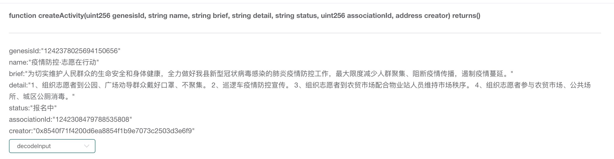

# Solidity-utils

Language： [中文](./README.md)

## Inroduction

The project  provided to analyze data in the Ethereum, currently implementing the analysis of input data which from transaction of small contract in Ethereum.

In the Etherum, we can query the extra data of transaction by hash or other qarameters.

 If a Blockchain project publishes their public data, users can choose to query the detail of a transaction from hash which is public in Blockchain. But now we can see that, what we get from the Ethereum is an array of bytes, and storaged according to a certain rule. 

As shown in the Figure 1, it's hard for users to understand the raw data, and requires users to analyze raw data manualy.

Out project provided method TransformTxData(abi string, input []byte), which needs params of the abi of small contract and the input data of a transaction, and ouputs the data which can be easier to understand, just as shown as Figure 2.


Figure 1  Raw Data




Figure 2  Decoded Data


## References

1. The data type of Solidity

[（1）Solidity编程 五 之 数据类型](https://www.cnblogs.com/StephenWu/p/7096550.html)

[（2）深入理解Solidity-类型](https://solidity-cn.readthedocs.io/zh/develop/types.html#arrays)

2. The binary interfaces of small contracts

[（3）智能合约应用程序二进制接口规范](https://www.cnblogs.com/chenshouchang/p/9979845.html)

3. Others

   [(4)进制转换工具](https://tool.lu/hexconvert/)


## The Binary Interfaces of Small Contracts

ref：

[智能合约应用程序二进制接口规范](https://www.cnblogs.com/chenshouchang/p/9979845.html)  We suggest that you should to read this article, which explains in detail the binary storage specifications in smart contracts.

[深入理解Solidity-类型](https://solidity-cn.readthedocs.io/zh/develop/types.html#arrays)

### Data Type

Smart contracts have the following basic types, including static types and dynamic types, while static types are divided into basic types and an array with fixed length.

The difference between a static stype and a dynamic type is that the EVM will store datas of static type firstly. While encountering datas of dynamic type, the EVM will record the offset of data, and store real data at offset position, where includes the length of data and the content of data.

```go
uint<M>: unsigned integer type of M bits, 0 < M <= 256, M % 8 == 0. e.g. uint8, uint16, uint24, uint36, uint256, static type

int<M>:  two’s complement signed integer type of M bits, 0 < M <= 256, M % 8 == 0. e.g. int8, int16, int24, int36, int256，static type

address: equivalent to uint160, 160 bits,static type

uint, int:  synonyms for uint256, int256 respectively,static type

bool: equivalent to uint8 restricted to the values 0 and 1. static type

fixed<M>x<N>: signed fixed-point decimal number of M bits and decimal point number of N bits,8 <= M <= 256, M % 8 == 0, 0 < N <= 80. e.g. fixed128x18，static type

ufixed<M>x<N>:  unsigned fixed-point decimal number of M bits and decimal point number of N bits,8 <= M <= 256, M % 8 == 0, 0 < N <= 80. e.g. fixed128x18，static type

fixed, ufixed: synonyms for fixed128x18, ufixed128x18 respectively. static type

bytes<M>: binary type of M bytes, 0 < M <= 32. static type

function: an address (20 bytes) followed by a function selector (4 bytes). Encoded identical to bytes24. static type


bytes: dynamic sized byte sequence, dynamic type

string: ynamic sized unicode string assumed to be UTF-8 encoded.dynamic type

<type>[]: a variable-length array of elements of the given type. dynamic type

(T1,T2,...,Tn): tuple consisting of the types T1, …, Tn, n >= 0  dynamic type

```

Our project provided the transformation of some common data types as follow:

```
boolint
address
string
bytes1, byte2, ... , byte31, byte32 
int, int8, int16, ... ,int248, int256
uint, uint8, uint16, ... ,uint248, uint256
int<M>[], uint<M>[], bytes<M>[]
```

### The Analysis of Input 

According to the binary storage specifications in smart contracts, we can split and analyze the input data of a transaction. Take a method of createActivity for example: 

```solidity
function createActivity(genesisId: uint256, name: string, brief: string, detail: string, status: string, associationId: uint256, creator: address)
```

1. Raw data：

```go
0x7afb2807000000000000000000000000000000000000000000000000113dd03b6240400000000000000000000000000000000000000000000000000000000000000000e0000000000000000000000000000000000000000000000000000000000000012000000000000000000000000000000000000000000000000000000000000002200000000000000000000000000000000000000000000000000000000000000360000000000000000000000000000000000000000000000000113d90faf74050000000000000000000000000008540f71f4200d6ea8854f1b9e7073c2503d3e6f9000000000000000000000000000000000000000000000000000000000000001de796abe68385e998b2e68ea7c2b7e5bf97e684bfe59ca8e8a18ce58aa800000000000000000000000000000000000000000000000000000000000000000000cfe4b8bae58887e5ae9ee7bbb4e68aa4e4babae6b091e7bea4e4bc97e79a84e7949fe591bde5ae89e585a8e5928ce8baabe4bd93e581a5e5bab7efbc8ce585a8e58a9be5819ae5a5bde68891e58ebfe696b0e59e8be586a0e78ab6e79785e6af92e6849fe69f93e79a84e882bae7828ee796abe68385e998b2e68ea7e5b7a5e4bd9cefbc8ce69c80e5a4a7e99990e5baa6e5878fe5b091e4babae7bea4e8819ae99b86e38081e998bbe696ade796abe68385e4bca0e692adefbc8ce9818fe588b6e796abe68385e89493e5bbb6e380820000000000000000000000000000000000000000000000000000000000000000000000000000000000000000000000010931e38081e7bb84e7bb87e5bf97e684bfe88085e588b0e585ace59bade38081e5b9bfe59cbae58a9de5afbce7bea4e4bc97e688b4e5a5bde58fa3e7bda9e38081e4b88de8819ae99b86e380820a32e38081e5b7a1e980bbe8bda6e796abe68385e998b2e68ea7e5aea3e4bca0e380820a33e38081e7bb84e7bb87e5bf97e684bfe88085e588b0e5869ce8b4b8e5b882e59cbae9858de59088e789a9e4b89ae7ab99e4babae59198e7bbb4e68c81e5b882e59cbae7a7a9e5ba8fe380820a34e38081e7bb84e7bb87e5bf97e684bfe88085e58f82e4b88ee5869ce8b4b8e5b882e59cbae38081e585ace585b1e59cbae68980e38081e59f8ee58cbae585ace58e95e6b688e6af92e3808200000000000000000000000000000000000000000000000000000000000000000000000000000000000000000000000000000000000009e68aa5e5908de4b8ad0000000000000000000000000000000000000000000000
```

2. Splited Data

```go
// Split in 32 bytes

0x7afb2807 //MethodID, the first 4 bytes of the Keccak hash
000000000000000000000000000000000000000000000000113dd03b62404000	//	uint256(static) genesisId
00000000000000000000000000000000000000000000000000000000000000e0	//	offset of string 224个字节(dynamic) name
0000000000000000000000000000000000000000000000000000000000000120	// 	offset of string 288个字节(dynamic) brief
0000000000000000000000000000000000000000000000000000000000000220	//	offset of string 544个字节(dynamic) detail
0000000000000000000000000000000000000000000000000000000000000360	//	offset of string 864个字节(dynamic) status
000000000000000000000000000000000000000000000000113d90faf7405000	//	uint256(static) associationId
0000000000000000000000008540f71f4200d6ea8854f1b9e7073c2503d3e6f9	//	address(static) creator

000000000000000000000000000000000000000000000000000000000000001d	//	29 bytes name
e796abe68385e998b2e68ea7c2b7e5bf97e684bfe59ca8e8a18ce58aa8000000	//	the content of data

00000000000000000000000000000000000000000000000000000000000000cf	//	207 bytes breif
e4b8bae58887e5ae9ee7bbb4e68aa4e4babae6b091e7bea4e4bc97e79a84e794	// 	the content of data
9fe591bde5ae89e585a8e5928ce8baabe4bd93e581a5e5bab7efbc8ce585a8e5
8a9be5819ae5a5bde68891e58ebfe696b0e59e8be586a0e78ab6e79785e6af92
e6849fe69f93e79a84e882bae7828ee796abe68385e998b2e68ea7e5b7a5e4bd
9cefbc8ce69c80e5a4a7e99990e5baa6e5878fe5b091e4babae7bea4e8819ae9
9b86e38081e998bbe696ade796abe68385e4bca0e692adefbc8ce9818fe588b6
e796abe68385e89493e5bbb6e380820000000000000000000000000000000000

0000000000000000000000000000000000000000000000000000000000000109	//	265 bytes detail
31e38081e7bb84e7bb87e5bf97e684bfe88085e588b0e585ace59bade38081e5	// 	the content of data
b9bfe59cbae58a9de5afbce7bea4e4bc97e688b4e5a5bde58fa3e7bda9e38081
e4b88de8819ae99b86e380820a32e38081e5b7a1e980bbe8bda6e796abe68385
e998b2e68ea7e5aea3e4bca0e380820a33e38081e7bb84e7bb87e5bf97e684bf
e88085e588b0e5869ce8b4b8e5b882e59cbae9858de59088e789a9e4b89ae7ab
99e4babae59198e7bbb4e68c81e5b882e59cbae7a7a9e5ba8fe380820a34e380
81e7bb84e7bb87e5bf97e684bfe88085e58f82e4b88ee5869ce8b4b8e5b882e5
9cbae38081e585ace585b1e59cbae68980e38081e59f8ee58cbae585ace58e95
e6b688e6af92e380820000000000000000000000000000000000000000000000

0000000000000000000000000000000000000000000000000000000000000009	//	9 bytes status
e68aa5e5908de4b8ad0000000000000000000000000000000000000000000000	// 	the content of data
```

## Implementation

### Data Struct

#### SolidityDataType

A struct describes data types in Solidity.

```go
type SolidityDataType struct {
	Name     string `json:"name"`     // name of data type, e.g. int32
	Type     Kind   `json:"type"`     // static type of dynamic type
	IsNumber bool   `json:"isNumber"` // is number
	IsArray  bool   `json:"isArray"`  // is array
	BitSize  int    `json:"bitSize"`  // the number of bit
}
```

#### InputData

A struct encapsulate byte array in Transaction.

```go
type InputData struct {
	Param     SolidityDataType `json:"-"`         //the data type of param
	ParamName string           `json:"paramName"` //the name of param
	Offset    int64            `json:"-"`         //offset, when the param is dynamic type, offset equal to 0
	Data      string           `json:"data"`      //the content of data
}
```

#### SolidityMethod

A struct describes methods in Solidity.

```go
type SolidityMethod struct {
	Name       string     `json:"name"`
	InputDatas InputDatas `json:"params"`
}
```

### Methods

#### GetSolidityTypeByName

Construct a SolidityType  by the data type name, and the following inputs can output the following:

```
name = "uint"	=>	returns { uint, value, 256 }		// uint, static type, 256 bits
name = "string"	=>	returns { string, variable, 0 }		// string, dynamic type, 0
name = "byte3[10]"	=>	returns { bytes3[10], value, 0}	// bytes3[10], static type, 3*8*10=240 bits
```

```go
func GetSolidityTypeByName(name string) *SolidityDataType {
	var bitSize = 0
	var typeName = VALUE
	var isNumber = false
	var isArray = false
	if name == BOOL { // bool
		bitSize = 8
	} else if name == ADDRESS {
		bitSize = 20 * 8
	} else if strings.Contains(name, UINT) {
		isNumber = true
		if len(name) == len(UINT) { // uint
			bitSize = 256
		} else if strings.Contains(name, "[") { //uint<M>[N]
			isArray = true
			base := 256
			left := strings.Index(name, "[")
			right := strings.Index(name, "]")
			length := cast.ToInt(name[left+1 : right]) // N
			if left > len(UINT) {                      //uint<M>[N]
				base = cast.ToInt(name[len(UINT):left]) // M
			}
			bitSize = base * length //M == 0 , uint[N]
		} else {
			bitSize = cast.ToInt(strings.Trim(name, UINT))
		}
	} else if strings.Contains(name, INT) {
		isNumber = true
		if len(name) == len(INT) { //int
			bitSize = 256
		} else if strings.Contains(name, "[") { //int[]
			isArray = true
			base := 256
			left := strings.Index(name, "[")
			right := strings.Index(name, "]")
			length := cast.ToInt(name[left+1 : right]) // N
			if left > len(INT) {                       //int<M>
				base = cast.ToInt(name[len(INT):left]) // M
			}
			bitSize = base * length //M == 0 , int[N]
		} else {
			bitSize = cast.ToInt(strings.Trim(name, INT))
		}
	} else if strings.Contains(name, BYTES) {
		if len(name) == len(BYTES) { //bytes is dynamic type
			typeName = VARIABLE
		} else if strings.Contains(name, "[") { //bytes[]
			isArray = true
			base := 1
			left := strings.Index(name, "[")
			right := strings.Index(name, "]")
			length := cast.ToInt(name[left+1 : right]) // N
			if left > len(BYTES) {                     //bytes<M>
				base = cast.ToInt(name[len(BYTES):left]) // M
			}
			bitSize = 8 * base * length //M == 0 , bytes[N]
		} else {
			bitSize = 8 * cast.ToInt(strings.Trim(name, BYTES))
		}
	} else if name == STRING {
		typeName = VARIABLE
	} else {
		bitSize = 0
		typeName = VALUE
		name = ""
	}
	return &SolidityDataType{name, typeName, isNumber, isArray, bitSize}
}
```

#### TransformTxData

Input parameters: the abi of small contract and the input data of transaction

Output: the SolidityMethod. 

```go
func TransformTxData(abiStr string, input []byte) (*SolidityMethod, error) {
	abi, err := abi.JSON(strings.NewReader(abiStr))
	if err != nil {
		return nil, err
	}
	method, err := abi.MethodById(input)
	if err != nil {
		return nil, err
	}
	inputDatas, err := unmarshalInput(method.Inputs, input)
	if err != nil {
		return nil, err
	}
	return &SolidityMethod{
		Name:       method.String(),
		InputDatas: inputDatas,
	}, nil
}

// transform inputs to InputDatas
func unmarshalInput(args abi.Arguments, input []byte) (InputDatas, error) {
	const head int64 = 4
	const bitSize int64 = 32
	var next = head

	var resultList InputDatas
	var inputData InputData
	for _, arg := range args {
		dataType := GetSolidityTypeByName(arg.Type.String())
		inputData.Param = *dataType
		inputData.ParamName = arg.Name
		inputData.Offset = 0
		if dataType.Type == VALUE { //static type
			inputData.Data = hexutil.Encode(input[next : next+bitSize])
			if dataType.IsNumber {
				dataInt, err := DecodeBigFromHex(inputData.Data)
				if err != nil {
					return nil, err
				}
				inputData.Data = config.ToString(dataInt)
			}
		} else { //dynamic type
			offsetHex := hexutil.Encode(input[next : next+bitSize])
			offsetInt, err := DecodeBigFromHex(offsetHex)
			if err != nil {
				return nil, err
			}
			inputData.Offset = offsetInt.Int64()

			dataHead := head + offsetInt.Int64()
			dataNext := dataHead + bitSize
			dataLenHex := hexutil.Encode(input[dataHead:dataNext])
			dataLen, err := DecodeBigFromHex(dataLenHex)
			if err != nil {
				return nil, err
			}
			dataHead = dataNext
			dataNext = dataHead + dataLen.Int64()
			inputData.Data = string(input[dataHead:dataNext])
		}
		next += bitSize
		resultList = append(resultList, inputData)
	}
	return resultList, nil
}
```

#### DecodeBigFromHex

Encapsulation the method  hexutils.DecodeBig(), but since this method only allows the incoming hexadecimal without leading zero digits, otherwise the program will throw exception: "hex number with leading zero digits".

So we wrote a method TrimLeadingZero(hexStr string), which removed the leading zero constanly through a loop to get hexadecimal string without leading zero digits. 

```go
// transform hexadecimal string to decimal number
func DecodeBigFromHex(hexStr string) (*big.Int, error) {
   hexStr = TrimLeadingZero(hexStr)
   return hexutil.DecodeBig(hexStr)
}

// trim the leading zero digits of hexStr
func TrimLeadingZero(hexStr string) string {
   if strings.Contains(hexStr, "0x") {
      hexStr = strings.TrimPrefix(hexStr, "0x")
   }
   for {
      if !strings.HasPrefix(hexStr, "0") { //break when the hexStr has not contained leading zero
         break
      }
      hexStr = strings.TrimPrefix(hexStr, "0")
   }
   if hexStr == "" {
      return "0x" + "0"
   }
   return "0x" + hexStr
}
```

